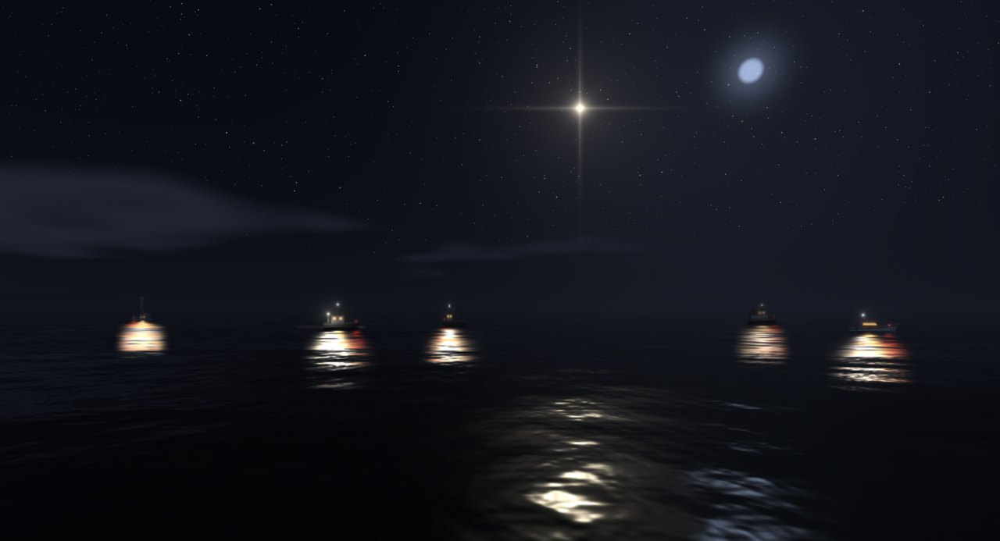
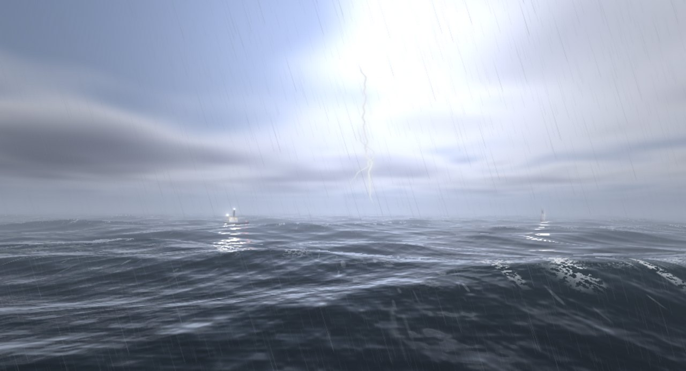

**繁體中文** · [English](README.en.md)

# VibingWrapper

跟著 Claude Code 工作節奏變天的 Windows 動態桌布。
*A Windows live wallpaper whose weather follows your Claude Code sessions — sky, sea and a little fleet of boats.*

Claude 在想事情，天空轉陰；開始跑工具，就下起雷雨；做完了，雨停放晴。
它停下來等你回答或批准的時候，天上會亮起一顆慢慢閃的星星。
你不用切視窗，眼角餘光就知道 AI 在做什麼。



## 狀態對照

| Claude Code 在做的事 | 天氣 | 右上角 HUD |
|---|---|---|
| 閒置 | 晴 | AI · 待命 |
| 收到你的指令（UserPromptSubmit） | 陰 | AI · 思考中 |
| 跑工具（PreToolUse） | 雷雨 | AI · 執行中 |
| 做完（Stop） | 轉晴，20 秒後變晴 | AI · 收尾 |
| 問你問題／等你批准 | 天色變暗，一顆星慢慢閃 | AI · 等你 |

**同時開好幾個 session（最多 5 個）**：每個 session 各記一份狀態，天空顯示最需要注意的那個（等你 > 雷雨 > 陰 > 轉晴 > 晴）。
有海的桌布上，每個 session 是一艘船：忙的船開動、拖出航跡，等你的船燈會閃，一眼就知道是哪一個在叫你。

## 三種桌布

齒輪選單 →「桌布」，點一下換下一種：

- **天氣**：只有天空。雲、雨、閃電、陽光光束，跟著台北的真實日出日落變化。
- **天氣＋海**：下半部是一片遠方的海，倒映同一片天空，海上有船隊。
- **海**：貼近海面的立體海，浪頭、白沫、月光，船隊在浪裡起伏。

<table>
<tr>
<td width="50%"><br>天氣・執行中（雷雨）</td>
<td width="50%"><br>天氣＋海・黃昏的船隊</td>
</tr>
<tr>
<td><br>海・白天</td>
<td><br>海・雷雨</td>
</tr>
</table>

桌布掛在桌面圖示底下，不會擋到任何東西。被全螢幕或最大化的視窗蓋住時會自動暫停。

## 小工具

| 功能 | 快捷鍵 |
|---|---|
| 收桌面（隱藏／顯示所有桌面圖示） | Ctrl+Alt+D |
| 一鍵隱藏（老闆鍵：桌布和 HUD 全收，只留一顆小齒輪） | Ctrl+Alt+B（齒輪選單可改） |
| 螢幕吸色（複製 #RRGGBB） | Ctrl+Q |
| 範圍截圖（剪貼簿＋存到「圖片\Saved Pictures」） | Ctrl+R |

## 安裝

需要：Windows 10／11、[Node.js](https://nodejs.org/) 18 以上、[Claude Code](https://claude.com/claude-code)。

```bash
git clone https://github.com/youllook/VibingWrapper.git
cd VibingWrapper
npm install
npm start
```

`npm run shortcut` 會在桌面建立捷徑。系統匣選單可以設定開機自動啟動。

## 接上 Claude Code

VibingWrapper 在本機 `127.0.0.1:47321` 收 Claude Code 的 hook 事件。把下面這段合併進 `~/.claude/settings.json` 的 `hooks`（已經有 hooks 的話，加進對應的陣列，不要整段覆蓋）：

```json
{
  "hooks": {
    "SessionStart":     [{ "hooks": [{ "type": "command", "command": "curl -s -m 1 -o /dev/null -X POST -H \"Content-Type: application/json\" --data-binary @- http://127.0.0.1:47321/claude 2>/dev/null || true", "timeout": 3, "async": true }] }],
    "UserPromptSubmit": [{ "hooks": [{ "type": "command", "command": "curl -s -m 1 -o /dev/null -X POST -H \"Content-Type: application/json\" --data-binary @- http://127.0.0.1:47321/claude 2>/dev/null || true", "timeout": 3, "async": true }] }],
    "PreToolUse":       [{ "hooks": [{ "type": "command", "command": "curl -s -m 1 -o /dev/null -X POST -H \"Content-Type: application/json\" --data-binary @- http://127.0.0.1:47321/claude 2>/dev/null || true", "timeout": 3, "async": true }] }],
    "Notification":     [{ "hooks": [{ "type": "command", "command": "curl -s -m 1 -o /dev/null -X POST -H \"Content-Type: application/json\" --data-binary @- http://127.0.0.1:47321/claude 2>/dev/null || true", "timeout": 3, "async": true }] }],
    "Stop":             [{ "hooks": [{ "type": "command", "command": "curl -s -m 1 -o /dev/null -X POST -H \"Content-Type: application/json\" --data-binary @- http://127.0.0.1:47321/claude 2>/dev/null || true", "timeout": 3, "async": true }] }],
    "SubagentStop":     [{ "hooks": [{ "type": "command", "command": "curl -s -m 1 -o /dev/null -X POST -H \"Content-Type: application/json\" --data-binary @- http://127.0.0.1:47321/claude 2>/dev/null || true", "timeout": 3, "async": true }] }],
    "SessionEnd":       [{ "hooks": [{ "type": "command", "command": "curl -s -m 1 -o /dev/null -X POST -H \"Content-Type: application/json\" --data-binary @- http://127.0.0.1:47321/claude 2>/dev/null || true", "timeout": 3, "async": true }] }]
  }
}
```

VibingWrapper 沒開的時候，curl 1 秒逾時就安靜放棄，不會拖慢 Claude Code。
已經開著的 Claude Code session 要重開一次才會讀到新的 hook。

收到的事件只記名稱和 session ID 的前 8 碼（`%APPDATA%\vibing-wrapper\weather-log.jsonl`，1 MB 輪替），不記錄任何提示內容、指令或路徑。

## 檔案

| 路徑 | 內容 |
|---|---|
| `main.js` | Electron 主程序：HUD 視窗、系統匣、設定 |
| `prototype/hud.html` | 右上角的 AI 狀態圖示＋齒輪選單 |
| `tools/claude-bridge.js` | 收 hook 事件 → 每個 session 的狀態 → 合成天氣 → `weather/state.json`；也負責提供 `weather/` 頁面 |
| `tools/wallpaper.js`、`attach-wallpaper.ps1` | 把桌布視窗掛到桌面圖示底下（WorkerW） |
| `weather/index.html` | 天氣桌布（`?sea=1` 是天氣＋海），單一 WebGL fragment shader |
| `weather/ocean.html` | 立體海與船隊 |
| `weather/demo.html` | 調參數用的預覽頁：切狀態、拉時間軸看日夜 |
| `tools/desktop-icons.*`、`boss-key.js`、`capture.*` | 收桌面、老闆鍵、吸色／截圖 |

## 致謝

- 雲的畫法參考 [power418/skygl](https://github.com/power418/skygl)（MIT），壓縮成單一 2D pass。
- 立體海和船隊由 Claude（Fable）設計實作；AI 狀態圖示與 logo 由 Codex 設計。
- 整個專案用 Claude Code 寫成。

## 授權

[MIT](LICENSE)
