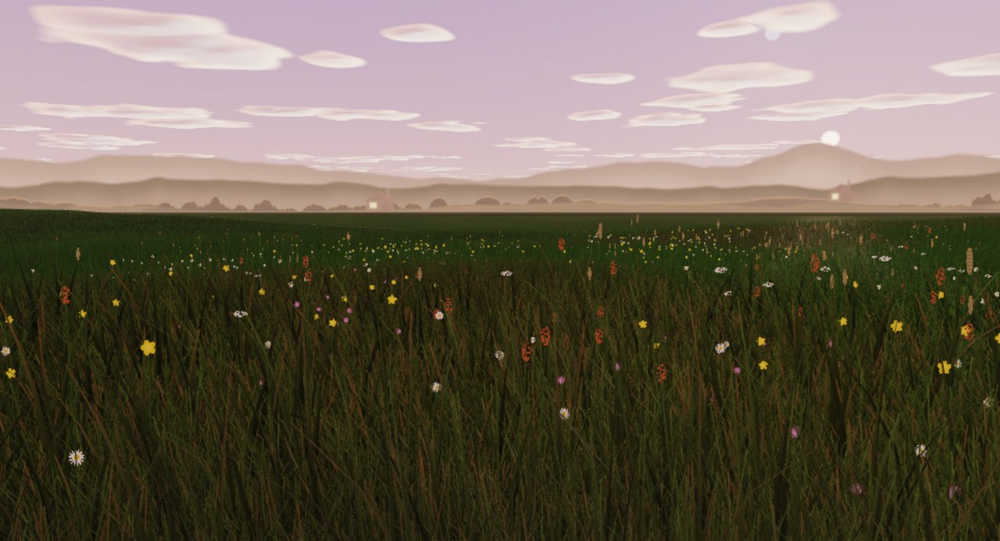

**繁體中文** · [English](README.en.md)

# VibingWrapper

跟著 Claude Code 工作節奏變天的 Windows 動態桌布。
*A Windows live wallpaper that follows your Claude Code sessions — sky, sea, snow peaks, rice paddies and a level crossing.*

Claude 在想事情，天空轉陰；開始跑工具，就下起雷雨；做完了，雨停放晴。
它停下來等你回答或批准的時候，天上會亮起一顆慢慢閃的星星。
你不用切視窗，眼角餘光就知道 AI 在做什麼。


## 狀態對照

| Claude Code 在做的事 | 天氣 | 右上角 HUD |
|---|---|---|
| 閒置 | 晴 | AI · 待命 |
| 收到你的指令（UserPromptSubmit） | 陰 | AI · 思考中 |
| 跑工具（PreToolUse） | 雷雨 | AI · 執行中 |
| 做完（Stop） | 轉晴，20 秒後變晴 | AI · 收尾 |
| 問你問題／等你批准 | 天色變暗，一顆星慢慢閃 | AI · 等你 |

**同時開好幾個 session（最多 5 個）**：每個 session 各記一份狀態，天空顯示最需要注意的那個（等你 > 雷雨 > 陰 > 轉晴 > 晴）。
有海的桌布上，每個 session 是一艘船：忙的船開動、拖出航跡，等你的船燈會閃，一眼就知道是哪一個在叫你。

## 桌布

齒輪選單 →「桌布」，點一下換下一種。每一種都用自己的方式演同一套狀態：

| 桌布 | 場景 | Claude 忙起來的時候 |
|---|---|---|
| **天氣** | 只有天空：雲、雨、閃電、陽光光束，跟著台北的真實日出日落 | 轉陰、下雷雨 |
| **天氣＋海** | 遠方的海倒映同一片天空，一個 session 一艘船 | 雷雨，船開動拖出航跡 |
| **海** | 貼近海面的立體海：浪頭、白沫、月光，船隊在浪裡起伏 | 雷雨、白浪 |
| **雪山雲海** | 站在台灣高山稜線看雲海，一個 session 一頂登山帳 | 天空一直晴（真實雲海就是晴天），雲海漲起、翻過鞍部變雲瀑、稜線吹起風雪 |
| **稻田** | 屏東鄉下的稻田、遠山、小木屋，大太陽 | 風越大稻浪越大，木屋炊煙越濃 |
| **寫實草原** | 幾十萬片草葉在風裡彎腰，一個 session 一間小木屋 | 陣風像浪一樣掃過草地，捲起枯葉 |
| **平交道** | 屏東鄉間的台鐵平交道（Godot 4） | 思考時警報響、柵欄放下；工作多久，列車就開多久 |

<table>
<tr>
<td width="50%"><br>雪山雲海・早晨</td>
<td width="50%"><br>雪山雲海・夜裡工作中，雲海翻騰</td>
</tr>
<tr>
<td><br>平交道・工作中，列車一節一節開過去</td>
<td><br>平交道・夜晚警報</td>
</tr>
<tr>
<td><br>稻田・大太陽</td>
<td><br>寫實草原・黃昏</td>
</tr>
<tr>
<td><br>天氣・執行中（雷雨）</td>
<td><br>天氣＋海・黃昏的船隊</td>
</tr>
<tr>
<td><br>海・白天</td>
<td><br>海・雷雨</td>
</tr>
</table>

齒輪選單的「模式」可以切 預設（跟著真實時間）／日間／夜間。

桌布掛在桌面圖示底下，不會擋到任何東西。被全螢幕或最大化的視窗蓋住時會自動暫停。

**平交道要自己建置**：它是 Godot 4 的網頁匯出（約 60 MB），git 只放原始碼（`godot/crossing/`），步驟見 [themes/crossing/README.md](themes/crossing/README.md)；沒建置的話選單裡選它會是空白。

### 自己做一個主題

每種桌布是 `themes/` 底下的一個資料夾（`theme.json`＋頁面＋說明）。複製一個資料夾、改 `theme.json` 的名稱，
齒輪選單的「桌布」就會多一個選項，不用改主程式。規格見 [themes/README.md](themes/README.md)。

## 小工具

| 功能 | 快捷鍵 |
|---|---|
| 收桌面（隱藏／顯示所有桌面圖示） | Ctrl+Alt+D |
| 一鍵隱藏（老闆鍵：桌布和 HUD 全收，只留一顆小齒輪） | Ctrl+Alt+B（齒輪選單可改） |
| 螢幕吸色（複製 #RRGGBB） | Ctrl+Q |
| 範圍截圖（剪貼簿＋存到「圖片\Saved Pictures」） | Ctrl+R |

## 快速體驗（免安裝）

1. 到 [Releases](https://github.com/youllook/VibingWrapper/releases/latest) 下載 `VibingWrapper-x.y.z-win-x64.zip`，解壓到任何資料夾。
2. 執行 `VibingWrapper.exe`。程式沒有簽章，Windows 跳出「Windows 已保護您的電腦」的話，按「其他資訊」→「仍要執行」。
3. 點右上角齒輪 →「Claude 連動」→ 點一下，自動把 hook 加進 `~/.claude/settings.json`（原檔會先備份成 `settings.json.vibing-backup`，已有的設定都會保留）。
4. 重開 Claude Code，開始工作，天空就會跟著變。

不需要 Node.js，七種桌布（含 Godot 做的平交道）都包在裡面。

## 從原始碼執行

需要：Windows 10／11、[Node.js](https://nodejs.org/) 18 以上、[Claude Code](https://claude.com/claude-code)。

```bash
git clone https://github.com/youllook/VibingWrapper.git
cd VibingWrapper
npm install
npm start
```

`npm run shortcut` 會在桌面建立捷徑；`npm run dist` 打包成 `dist/VibingWrapper-x.y.z-win-x64.zip`（平交道要先用 Godot 匯出，見 `themes/crossing/README.md`）。系統匣選單可以設定開機自動啟動。

## 接上 Claude Code

齒輪選單的「Claude 連動」可以一鍵安裝（見上面「快速體驗」）。想自己改的話：VibingWrapper 在本機 `127.0.0.1:47321` 收 Claude Code 的 hook 事件。把下面這段合併進 `~/.claude/settings.json` 的 `hooks`（已經有 hooks 的話，加進對應的陣列，不要整段覆蓋）：

```json
{
  "hooks": {
    "SessionStart":     [{ "hooks": [{ "type": "command", "command": "curl -s -m 1 -o /dev/null -X POST -H \"Content-Type: application/json\" --data-binary @- http://127.0.0.1:47321/claude 2>/dev/null || true", "timeout": 3, "async": true }] }],
    "UserPromptSubmit": [{ "hooks": [{ "type": "command", "command": "curl -s -m 1 -o /dev/null -X POST -H \"Content-Type: application/json\" --data-binary @- http://127.0.0.1:47321/claude 2>/dev/null || true", "timeout": 3, "async": true }] }],
    "PreToolUse":       [{ "hooks": [{ "type": "command", "command": "curl -s -m 1 -o /dev/null -X POST -H \"Content-Type: application/json\" --data-binary @- http://127.0.0.1:47321/claude 2>/dev/null || true", "timeout": 3, "async": true }] }],
    "Notification":     [{ "hooks": [{ "type": "command", "command": "curl -s -m 1 -o /dev/null -X POST -H \"Content-Type: application/json\" --data-binary @- http://127.0.0.1:47321/claude 2>/dev/null || true", "timeout": 3, "async": true }] }],
    "Stop":             [{ "hooks": [{ "type": "command", "command": "curl -s -m 1 -o /dev/null -X POST -H \"Content-Type: application/json\" --data-binary @- http://127.0.0.1:47321/claude 2>/dev/null || true", "timeout": 3, "async": true }] }],
    "SubagentStop":     [{ "hooks": [{ "type": "command", "command": "curl -s -m 1 -o /dev/null -X POST -H \"Content-Type: application/json\" --data-binary @- http://127.0.0.1:47321/claude 2>/dev/null || true", "timeout": 3, "async": true }] }],
    "SessionEnd":       [{ "hooks": [{ "type": "command", "command": "curl -s -m 1 -o /dev/null -X POST -H \"Content-Type: application/json\" --data-binary @- http://127.0.0.1:47321/claude 2>/dev/null || true", "timeout": 3, "async": true }] }]
  }
}
```

VibingWrapper 沒開的時候，curl 1 秒逾時就安靜放棄，不會拖慢 Claude Code。
已經開著的 Claude Code session 要重開一次才會讀到新的 hook。

收到的事件只記名稱和 session ID 的前 8 碼（`%APPDATA%\vibing-wrapper\weather-log.jsonl`，1 MB 輪替），不記錄任何提示內容、指令或路徑。

## 檔案

| 路徑 | 內容 |
|---|---|
| `main.js` | Electron 主程序：HUD 視窗、系統匣、設定 |
| `prototype/hud.html` | 右上角的 AI 狀態圖示＋齒輪選單 |
| `tools/claude-bridge.js` | 收 hook 事件 → 每個 session 的狀態 → 合成天氣 → `%APPDATA%\vibing-wrapper\state.json`；也負責提供 `themes/` 頁面與主題清單 |
| `tools/claude-hooks.js` | 齒輪「Claude 連動」：把 hook 補進 `~/.claude/settings.json` |
| `tools/wallpaper.js`、`attach-wallpaper.ps1` | 把桌布視窗掛到桌面圖示底下（WorkerW） |
| `themes/<id>/` | 每種桌布一個資料夾：`theme.json`、`index.html`（單一 WebGL shader）、`README.md`；現有 `weather`、`sea`、`ocean`、`snowpeak`、`paddy`、`meadow-real`、`crossing`（`network` 停用） |
| `godot/crossing/` | 平交道的 Godot 4 原始碼（場景全用程式生成，`shell.html` 是網頁外殼） |
| `themes/demo.html` | 調參數用的預覽頁：選主題、切狀態、拉時間軸看日夜 |
| `tools/desktop-icons.*`、`boss-key.js`、`capture.*` | 收桌面、老闆鍵、吸色／截圖 |

## 致謝

- 雲的畫法參考 [power418/skygl](https://github.com/power418/skygl)（MIT），壓縮成單一 2D pass。
- 稻田和寫實草原的草葉做法移植自 SimonDev 的 [Quick_Grass](https://github.com/simondevyoutube/Quick_Grass)（MIT），源自 Ghost of Tsushima 的 GDC 2021 演講。
- 平交道用 [Godot 4](https://godotengine.org/) 製作。
- 立體海、船隊和雪山雲海的起頭由 Claude（Fable）設計實作；AI 狀態圖示、logo 和平交道的貼圖由 Codex 繪製。
- 整個專案用 Claude Code 寫成。

## 授權

[MIT](LICENSE)
